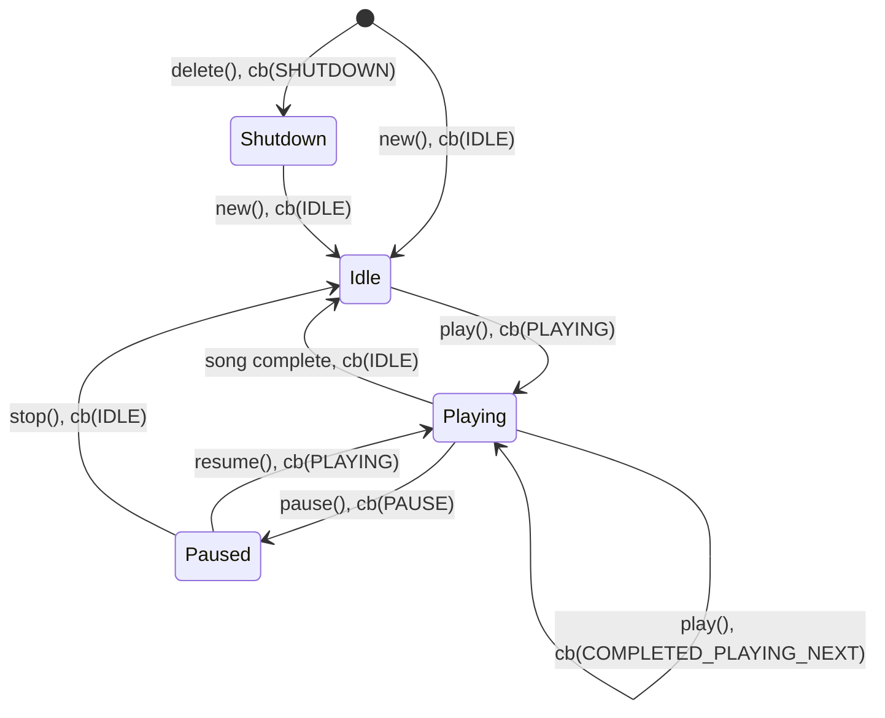

# Audio player component for esp32


[](https://github.com/chmorgan/esp-audio-player/actions/workflows/cppcheck.yml)

## Capabilities

* MP3 decoding (via libhelix-mp3)
* Wav/wave file decoding
* Audio mixing (multiple concurrent streams)

## Who is this for?

Decode only audio playback on esp32 series of chips, where the features and footprint of esp-adf are not 
necessary.

## What about esp-adf?

This component is not intended to compete with esp-adf, a much more fully developed
audio framework.

It does however have a number of advantages at the moment including:

* Fully open source (esp-adf has a number of binary modules at the moment)
* Minimal size (it's less capable, but also simpler, than esp-adf)

## Getting started

### Examples

* [esp-box mp3_demo](https://github.com/espressif/esp-box/tree/master/examples/mp3_demo) uses esp-audio-player.
* The [test example](https://github.com/chmorgan/esp-audio-player/tree/main/test) is a simpler example than mp3_demo that also uses the esp-box hardware.

### How to use this?
[esp-audio-player is a component](https://components.espressif.com/components/chmorgan/esp-audio-player) on the [Espressif component registry](https://components.espressif.com).

In your project run:
```
idf.py add-dependency chmorgan/esp-audio-player
```

to add the component dependency to the project's manifest file.


## Dependencies

For MP3 support you'll need the [esp-libhelix-mp3](https://github.com/chmorgan/esp-libhelix-mp3) component.

## Tests

Unity tests are implemented in the [test/](../test) folder.


## Audio Mixer

The Audio Mixer allows for concurrent playback of multiple audio streams. It supports two types of streams:

* **Decoder Streams**: For playing MP3 or WAV files. Each stream runs its own decoding task.
* **Raw PCM Streams**: For writing raw PCM data directly to the mixer.

### Basic Mixer Usage

1. Initialize the mixer with output format and I2S write functions.
2. Create one or more streams using `audio_stream_new()`.
3. Start playback on the streams.

```c
audio_mixer_config_t mixer_cfg = {
    .write_fn = bsp_i2s_write,
    .clk_set_fn = bsp_i2s_reconfig_clk,
    .i2s_format = {
        .sample_rate = 44100,
        .bits_per_sample = 16,
        .channels = 2
    },
    // ...
};
audio_mixer_init(&mixer_cfg);

audio_stream_config_t stream_cfg = DEFAULT_AUDIO_STREAM_CONFIG("bgm");
audio_stream_handle_t bgm_stream = audio_stream_new(&stream_cfg);

FILE *f = fopen("/sdcard/music.mp3", "rb");
audio_stream_play(bgm_stream, f);
```

## States



Note: Diagram shortens callbacks from AUDIO_PLAYER_EVENT_xxx to xxx, and functions from audio_player_xxx() to xxx(), for clarity.


## Release process - Pushing component to the IDF Component Registry

The github workflow, .github/workflows/esp_upload_component.yml, pushes data to the espressif
[IDF component registry](https://components.espressif.com).

To push a new version:

* Apply a git tag via 'git tag vA.B.C'
* Push tags via 'git push --tags'

The github workflow *should* run and automatically push to the IDF component registry.
